# jetbrains-student-pack-guide
Student Guide: How to Get the JetBrains Student Pack (Without School Email)
# 🎓 JetBrains Student Pack Guide (Without School Email)

A step-by-step guide to get **free access to JetBrains IDEs, AI tools, plugins, and courses** using the GitHub Student Developer Pack — even if your school email cannot receive external emails.

---

## 📚 Table of Contents
- [📌 Overview](#-overview)
- [⚠️ Important](#️-important)
- [🧭 Step-by-Step Guide](#-step-by-step-guide)
  - [Step 1: Create a GitHub Account](#step-1-create-a-github-account)
  - [Step 2: Apply for GitHub Student Developer Pack](#step-2-apply-for-github-student-developer-pack)
  - [Step 3: Fill Payment Information](#step-3-fill-payment-information-required)
  - [Step 4: Submit Student Verification](#step-4-submit-student-verification)
  - [Step 5: Wait for Approval](#step-5-wait-for-approval)
- [🚀 Apply for JetBrains Student Pack](#-apply-for-jetbrains-student-pack)
  - [Step 6: Request Access](#step-6-request-access-via-github)
  - [Step 7: Complete Application](#step-7-complete-application)
  - [Step 8: Email Verification](#step-8-email-verification)
  - [Step 9: Activate License](#step-9-activate-your-license)
- [✅ What You Get](#-what-you-get)
- [💡 Tips](#-tips)
- [🏁 Final Note](#-final-note)

---

## 📌 Overview
Some students cannot verify their academic status using a school email.

### ✅ Option 1: ISIC Card (Paid)
- https://www.isic.org/  
- https://www.issta.co.il/isic  
- Cost: ~50 ILS  

### ✅ Option 2 (Recommended): GitHub Student Developer Pack (Free)
- Free with student ID  
- No extra card needed  
- Takes a few days  

👉 This guide focuses on Option 2.

---

## ⚠️ Important
**Use your PRIVATE email only (NOT school email).**

---

# 🧭 Step-by-Step Guide

## Step 1: Create a GitHub Account
https://education.github.com/pack  
Click **Sign up** and create an account using your **private email address**.

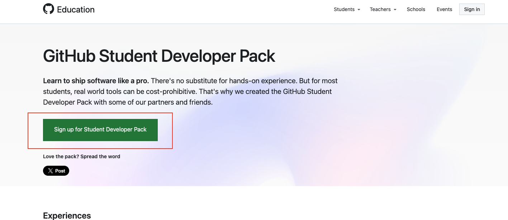

---

## Step 2: Apply for GitHub Student Developer Pack
Fill in your email, user and region (Israel).

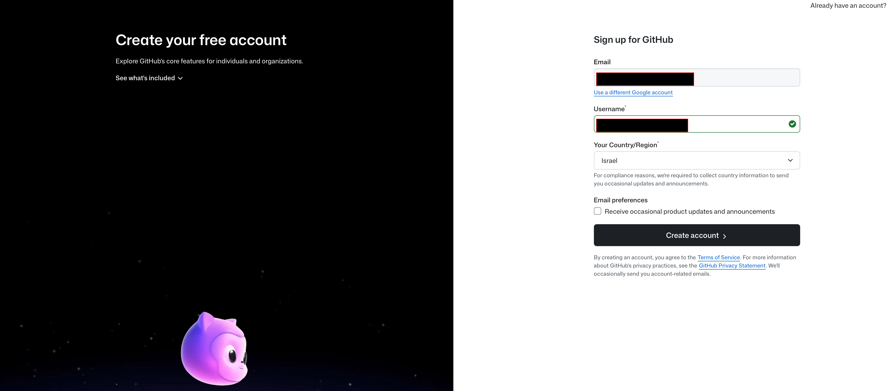

---

## Step 3: Fill Payment Information (Required)
Go to:
**Billing & Licensing → Payment Information**

⚠️ No credit card required.

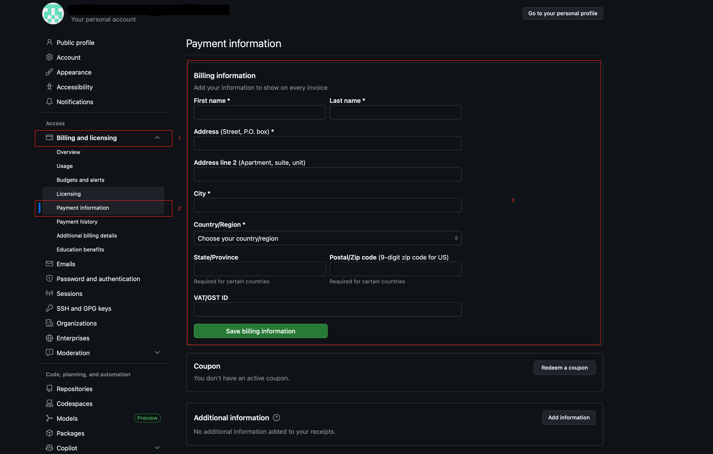

---

## Step 4: Submit Student Verification
Go to:
**Billing & Licensing → Education Benefits**
- Click **Start an application**  

Follow the instructions:
- Allow location access  
- Select your school  
- Upload a photo of your student ID  
- Submit  

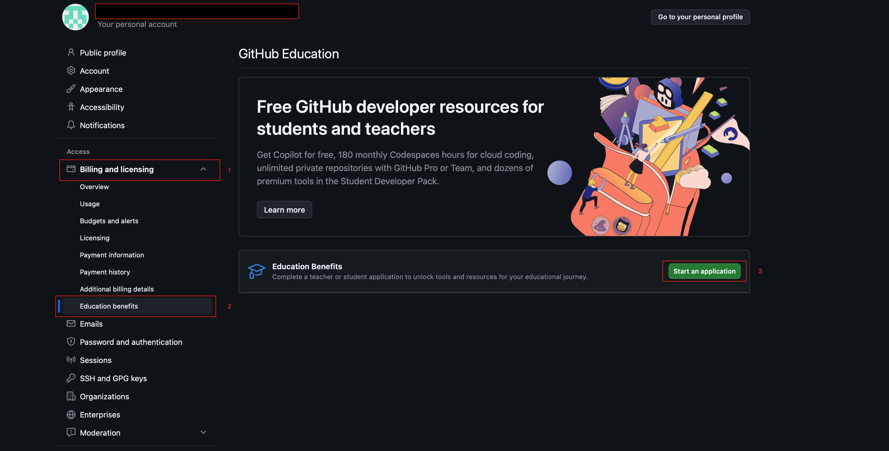

---

## Step 5: Wait for Approval
⏳ Approval usually takes **~3 days**  
- You will receive:
  1. Academic status approval  
  2. Final confirmation
  
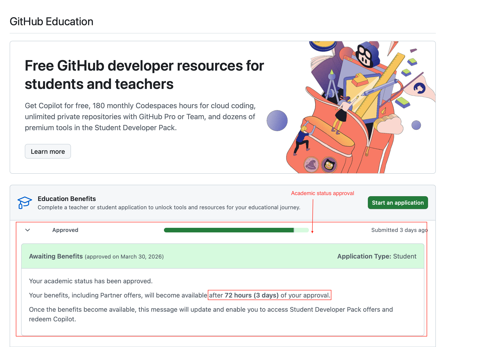
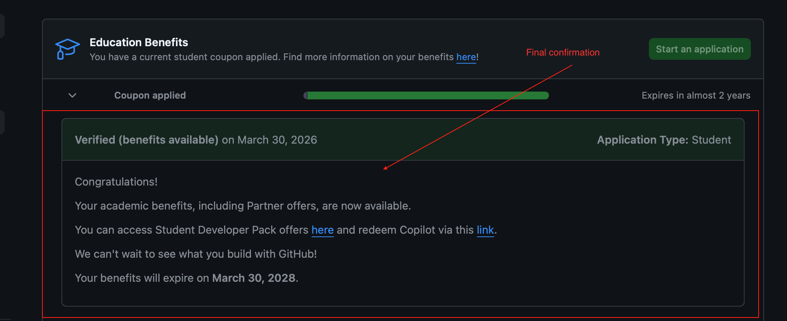

📌 If rejected:
- Read the reason carefully  
- Follow instructions and reapply  

If rejected → follow instructions and retry.

---

# 🚀 Apply for JetBrains Student Pack

## Step 6: Request Access via GitHub
https://www.jetbrains.com/academy/student-pack/#students  

- Click **Request Now**  
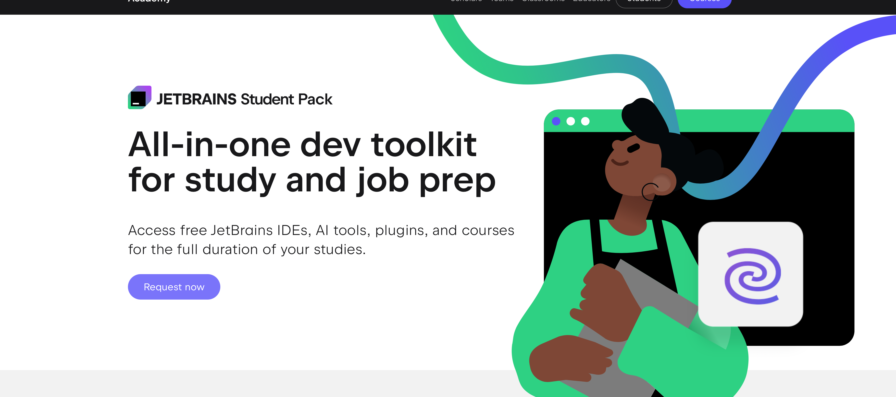
- Select **GitHub**
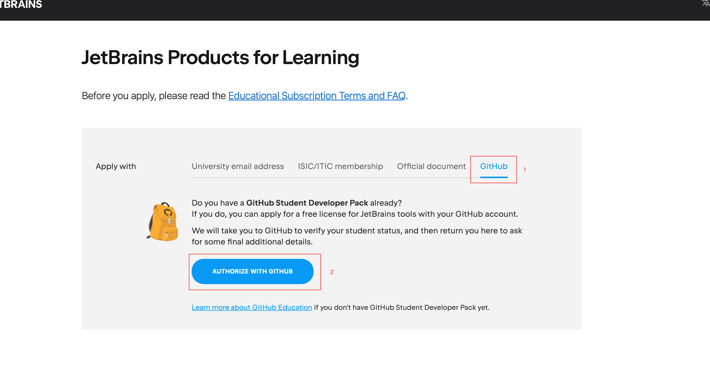
- Click **Authorize with GitHub**
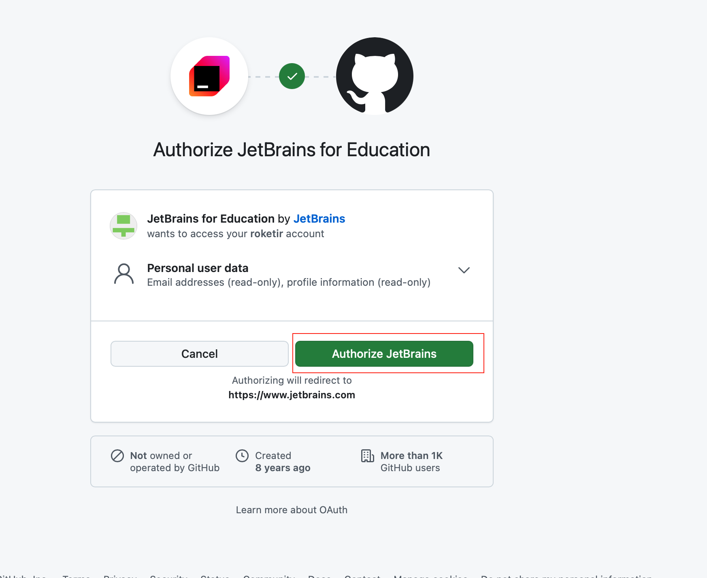  
---

## Step 7: Complete Application
Fill details + CAPTCHA.

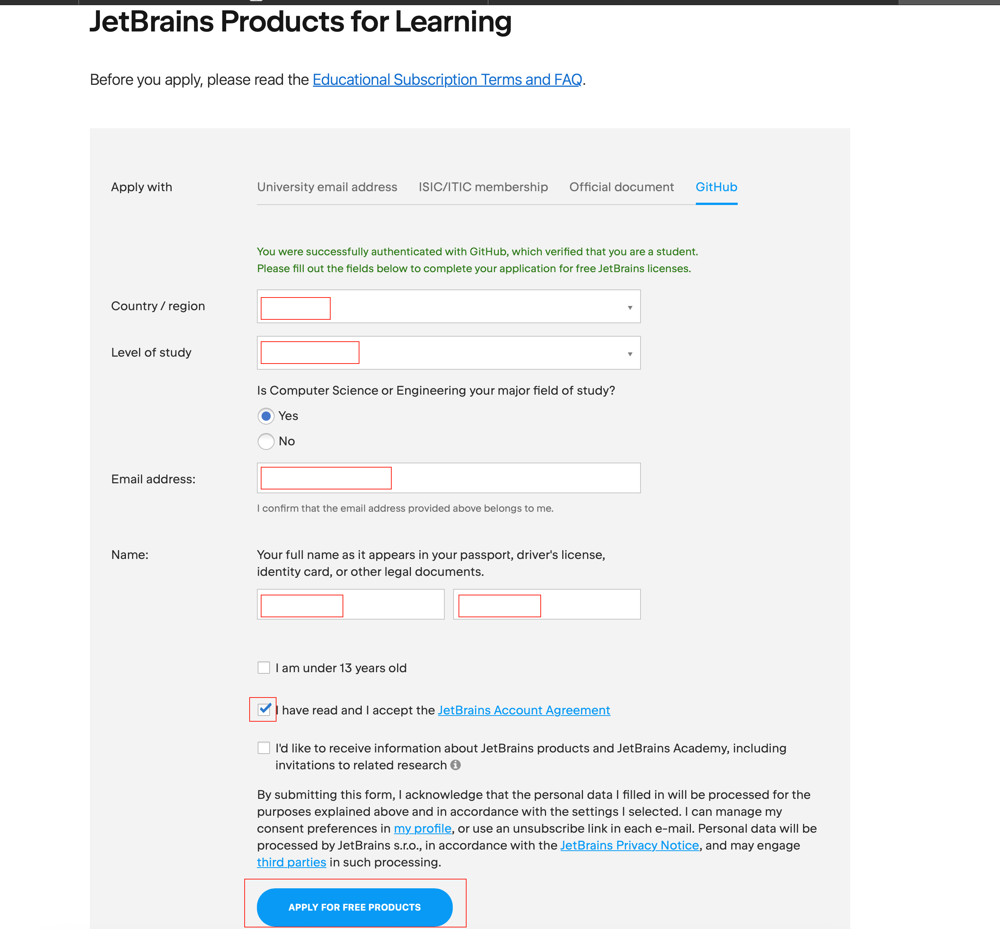
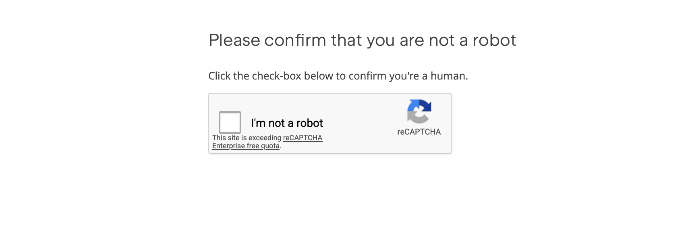

---

## Step 8: Email Verification
Check your private email and confirm.

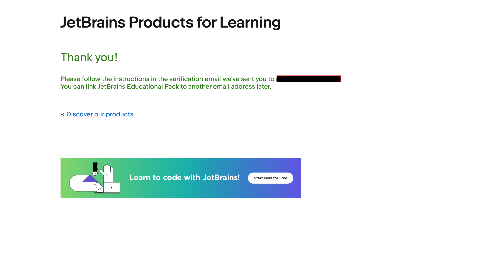

---

## Step 9: Activate Your License
- Click **Get Started to use**
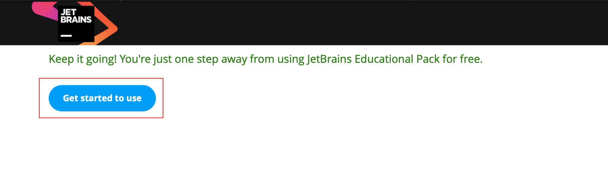
- Scroll down and accept terms
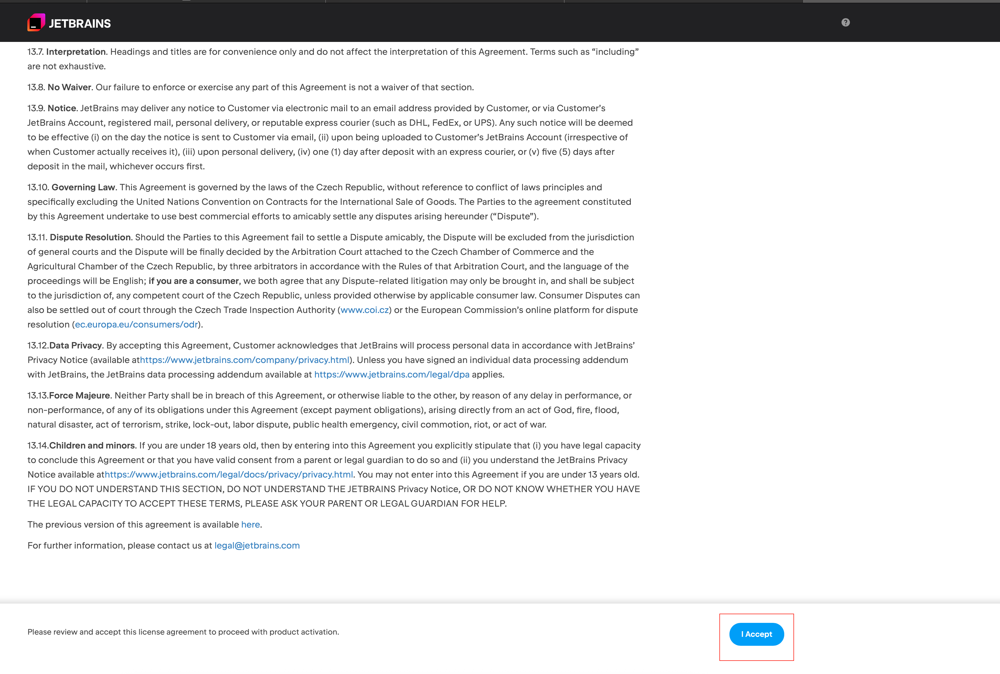

🎉 Done!
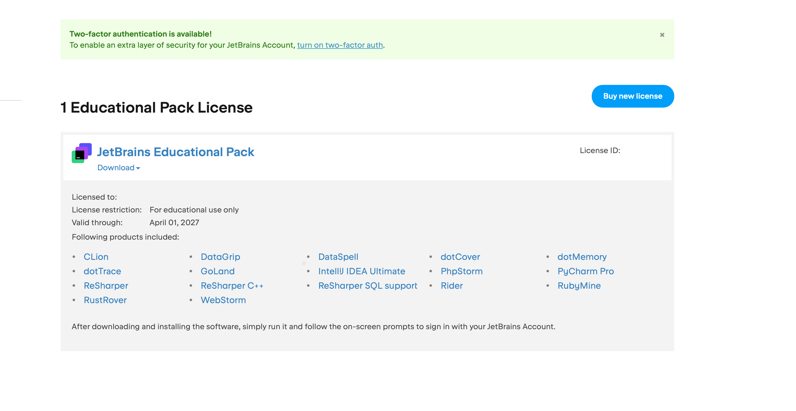

---

# ✅ What You Get
- 🎓 JetBrains License  
- 💻 GitHub Student Pack  

---

## 💡 Tips
- Match student ID details  
- Use clear photo  
- Be patient  

---

## 🏁 Final Note
Fully free method. Works without student email.

---

## ⭐ If this helped
Give the repo a star ⭐
